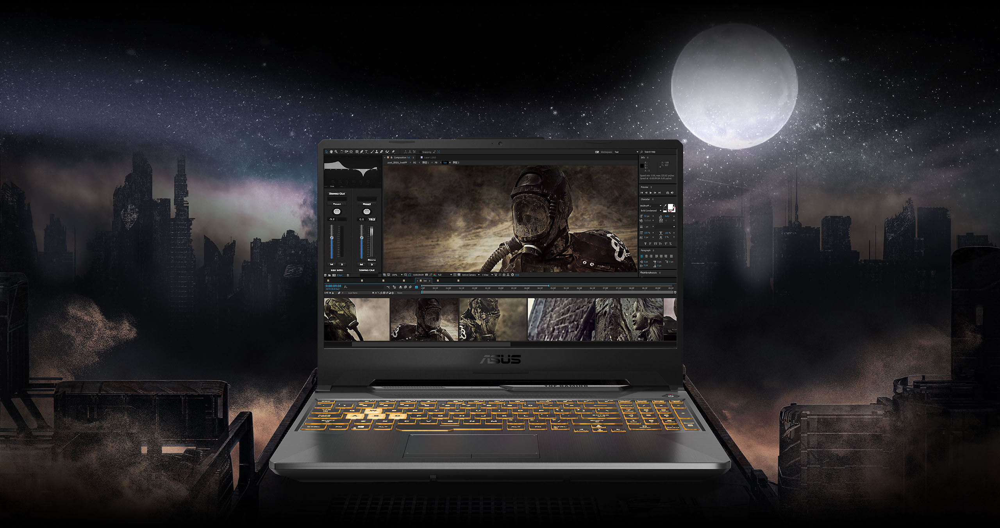

<h1 
OpenCore EFI for ASUS TUF Gaming F15 FX506LH.

### 
EFI config for ASUS TUF Gaming F15 FX506LH

<h5 ### macOS Ventura 

Specification | Working
------------- | -------------
CPU  | i5-10300H ✅
GPU  | GTX 1650 ❌, Intel UHD Graphics 630 ✅
WiFi & BT  | MT7921 ❌, replaced Intel-AX200NGW ✅
RAM  | Mikron 8GB/24GB 3200MHz ✅
Storage  | Kingston NV1 - M2 ✅
Ethernet  | RTL8168/8111 ✅
Touchpad  |  ✅
Battery & Status Battery | ✅

  

